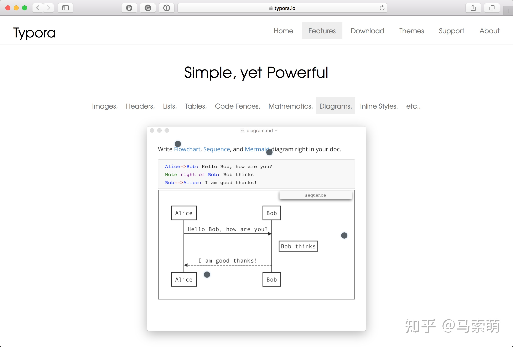
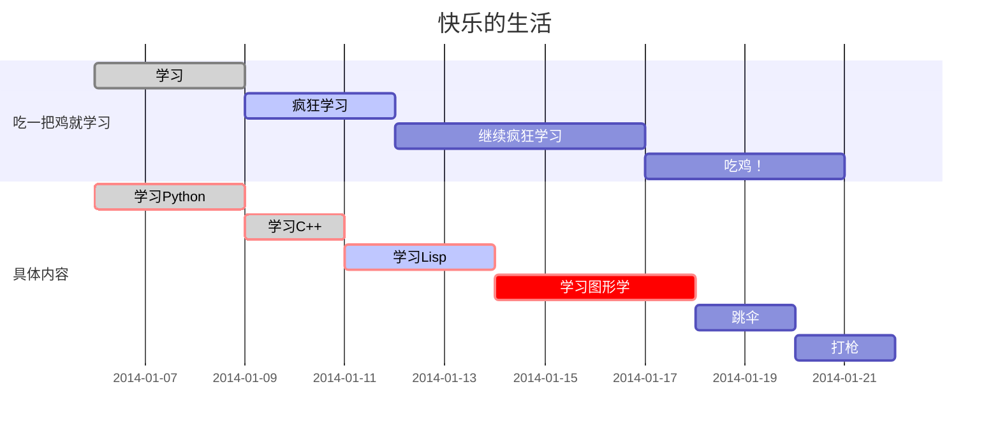

#  Typora，世界上最漂亮的写作App

有一种爱情是一触即发。看到Typora的第一眼，我就爱上了它。它没有专业软件那么复杂而难以上手的功能，却也没有为了简洁而妥协到难以使用，它的每一寸肌肤都恰到好处，与它相处的每一刻都十分愉悦。

**注意：知乎压缩图片比较厉害，清晰图片请点击图片查看原图**

## 相遇

我是个工具控，很长时间以来我都用emacs写markdown，自从我从spacemacs跳坑vs code之后便用vs code写作了一段时间，体验极好。不过我总是手痒，不折腾会死，所以就搜了一波有没有什么专门用来写作的app。

下面几个功能在我的需求中具有一票否决权：

- 可以使用markdown语法
- 我需要大量编辑代码
- 数学公式的编辑支持要好

首先我搜到的是Ulysses，试用了一下，这个App做的非常出色，排版精美，写作编辑、文件管理一体化。但是它原生并不支持数学公式的编辑，官方给出的方案有两个：

1. 导出到markdown然后用pandoc转成pdf
2. 在导出的html上加入mathjax的代码来完成公式的展示

这两个方案我本来还可以接受，然而在我真正尝试之后便放弃了，原因是Ulysses自己扩展了markdown语法，比如`{i\pi}`这段代码中`{}`和`\`都是特殊字符，我试了半天都没找到怎么在导出的markdown文件中正确显示`\`。我不甘心，于是又google解决方法，没想到没看到解决方法，反倒看到了Typora的介绍，说它是最漂亮的markdown编辑器，数学公式什么的都支持的很好，我就很好奇地打开了他家的网站。



首页简洁的风格一下子就抓住了我的眼睛，一分钟之后我便爱上了这个App。

## **数学公式**

Typora对于 ![[公式]](https://www.zhihu.com/equation?tex=%5CLaTeX) 语法支持的非常完善，内置的渲染引擎堪称完美，同类App我没见过比它更好的。下图是Typora内编辑数学公式的截图。


## **图片**

Typora对于图片渲染的支持也十分到位，可以直接拖拽图片，QQ截图可以直接粘贴（图片路径在临时文件夹），支持html code，所以可以进行缩放等操作。

## **代码块**

毫无疑问，作为一款程序员的作品，完美的代码展示是必不可少的功能。


## **流程图**

Typora可以直接在markdown中画流程图，而且语法简洁易懂，这是个让我异常惊喜的功能。


Typora使用`flowchart.js`来生成简单的SVG流程图，此外它还支持[mermaid engine](https://link.zhihu.com/?target=https%3A//mermaidjs.github.io/)。要知道，在市面上你绝少看到此类用户体验良好的作图App，更别说集成在一个markdown编辑器里面了。Typora支持三类流程图：

- sequence
- flowchart
- gantt

我们依次介绍。首先，只需要敲入以下代码，然后选择语言为`sequence`即可生成下面的图

```sequence
李雷 -> 韩梅梅: Hello 梅梅, How are you?
Note right of 韩梅梅: 韩梅梅心想
韩梅梅 --> 李雷: I'm fine, thanks, and you?
```

对于Flowchart，可以使用下面的code，然后语法选择flow

```flow
st=>start: 闹钟响起
op=>operation: 与床板分离
cond=>condition: 分离成功?
e=>end: 快乐的一天

st->op->cond
cond(yes)->e
cond(no)->op
```

[Mermaid](https://link.zhihu.com/?target=https%3A//mermaidjs.github.io/)是另一个流程图生成的引擎，在官网中它是这么介绍自己的

> Generation of diagrams and flowcharts from text in a similar manner as markdown.

除了Sequence和Flowchart两类图之外，Mermaid还提供一种叫做gantt的图。插入下面的代码，然后语法选`mermaid`就会自动渲染成gantt图了。



## **表格**

Typora中的表格是完全图形化操作的，非常方便。之前用过一些App（比如emacs），可以用文字+快捷键的方式编辑表格，然而需要记很多东西，不经常用就忘了。Typora的这个是真好用。表格的快捷键也很好记，`cmd + T` (Table)。也可以很方便地编辑表格的形状，如下图


## **大纲视图**

Typora会自动将Heading统计作为文章的大纲，而且根据标题的级别自动进行树状归纳。这个功能真的很贴心，尤其是文章长了的时候，只需要点击大纲中的标题就能很方便地跳转。

## **快捷键**

Typora的快捷键继承了Mac OS最大的优点，那就是命令与GUI的完美结合，方便直观，比如一级标题就是`cmd + 1`，二级标题就是`cmd + 2`，依次类推。这些快捷键使得在修改某段文字的标记的时候速度大大加快，原来的流程是手动去改文字的标记，现在我只需要按一下快捷键就行了。顺便感谢command键，按起来也比emacs的默认快捷键方便多了。

## **其他细节**

- 对于汉字字数统计非常准确，中英文混排时统计字数也毫无压力。
- 全平台app，windows linux macos都有，我全都要！
- 可以自定义主题

## **总结**

我在相当长一段时间内都不会再折腾写作App了。