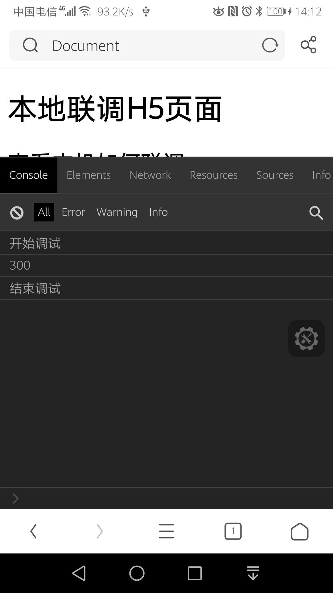

# 一、npm的使用

1. 获取原本镜像地址：npm get registry
2. 设置淘宝镜像： npm config set registry http://registry.npm.taobao.org/
3. 查看npm镜像源：npm config list
4. 清除node的缓存：npm cache clean -f
5. 更新node：npm install npm@latest -g

# 二、nrm 的使用

nrm是专门用来管理和快速切换私人配置registry

1. 全局安装：npm install  nrm -g --save
2. nrm ls：查看默认配置，带星号时当前配置
3. nrm current：查看当前使用的是哪个源
4. nrm use cnpm：切换源
5. 添加公司私有npm源：nrm add egoo http://maven3.egoodev.com:3210/repository/npm-egoo-repo/
6. nrm test npm: 测试速度
7. nrm del egoo：删除源

# 三、移动端调试H5页面

1. 下载eruda.js文件

2. 引入eruda.js文件

3. 初始化

4. 启动http-server

5. 用数据线连接手机，并和电脑保持连接同一网络。

6. 用浏览器打开。

   

# 四、

```javascript
<!DOCTYPE html>
<html lang="en">

<head>
    <meta charset="UTF-8">
    <meta name="viewport" content="width=device-width, initial-scale=1.0">
    <title>Document</title>
    <script src="./js/eruda.js"></script>
    <script>eruda.init();</script>
    <script>
        alert(333)
    </script>
    <script src="./js/target.js"></script>
    <script>
        console.log('开始调试');
        debugger;
        const a = 100;
        const b = 200;
        console.log(a + b);
        console.log('结束调试')
    </script>
</head>

<body>
    <h1>本地联调H5页面</h1>
    <h2>查看本机如何联调</h2>

</body>

</html>
```




# 其他

