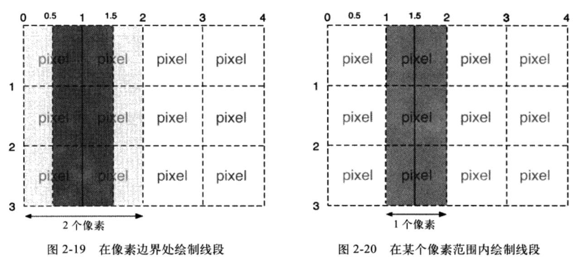
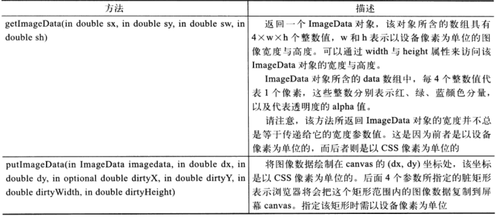

# 一、基础篇

1. 是用css设置canvas元素的大小与直接设置属性相比，差别在于：

   canvas元素实际上有两套尺寸，一个是元素本身的大小，还有一个是元素绘图表面的大小。当设置元素的width和height属性时，实际上是同时修改了该元素本身的大小和绘图区域的大小。然而，如果是通过css来设置的canvas元素的大小，那么只会改变元素本身的大小，而不会影响到绘图表面。

2. 在设置canvas的宽高时，按照规范，不要加px。

3. 两个向量的点积，需要将两个向量的对应分量相乘，然后再乘积相加。var dotProduct = vectorOne.x * vectorTwo.x + vectorOne.y * vectoryTwo.y。

4. 渐变：createLinearGradient

5. 放射渐变：createRadialGradient

6. createPattern描边和填充的方案，主要用在背景格子图。

7. 路径和子路径：

   在某一时刻，canvas之中只能有一条路径存在，canvas规范将其称其为当前路径，然而，这条径路径可以包含多条子路径。而子路径又是两个或更多的点组成的。用beginPath来开始一条新路径。如：如果画两个矩形，第二个矩形方法调用之前，没有使用beginPath,那么会向当前路径中增加一条子路径。这将会使得当前路径中的两条子路径被描边，这意味着他会重绘第一个矩形。

8. 像素问题

   

9. 获取某个字符串的像素宽度，可使用measureText(text)。

10. getImageData和putImageData参照

    

11. 

