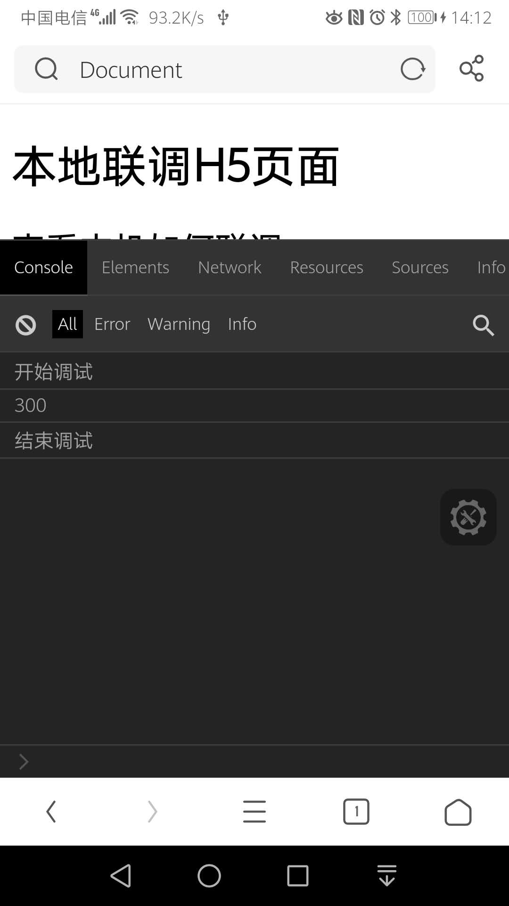
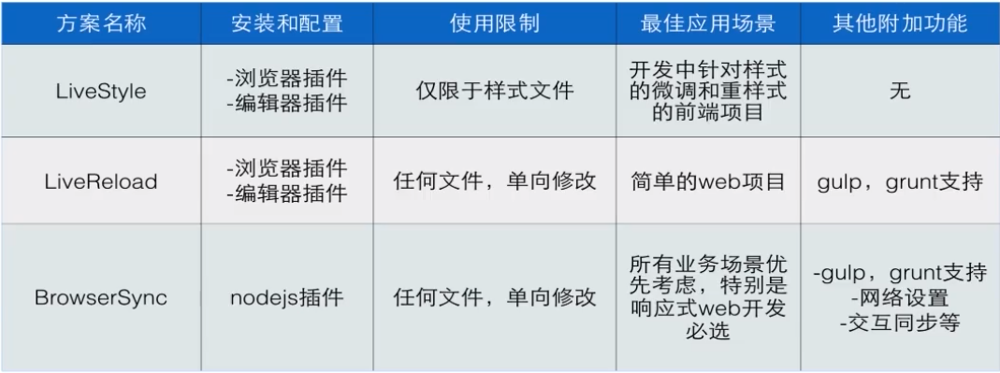
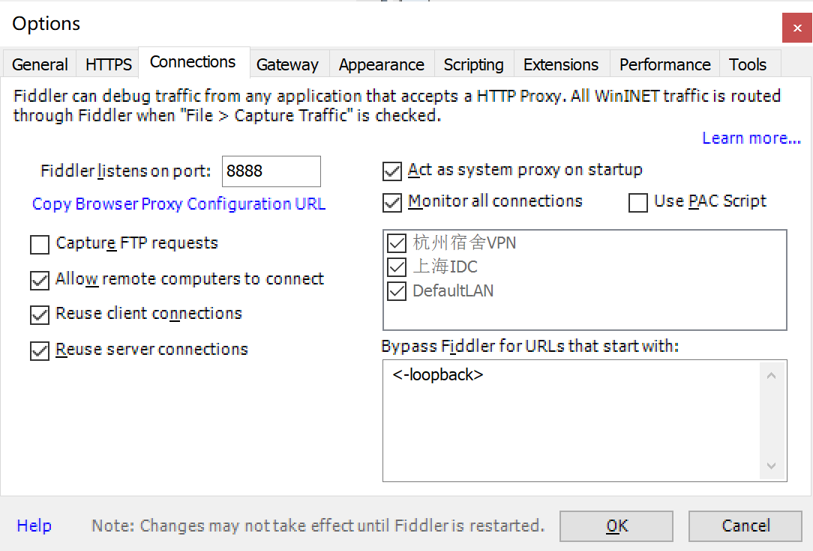
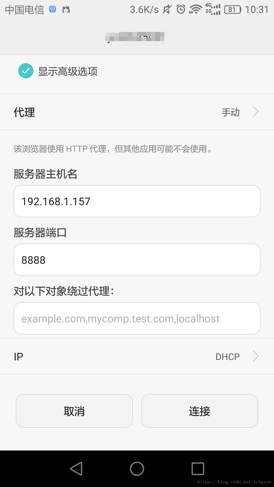
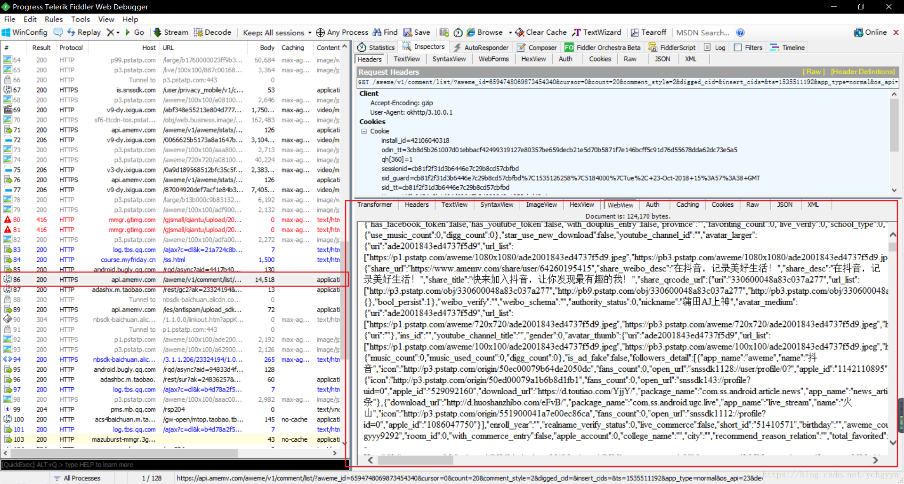

# 一、npm的使用

1. 获取原本镜像地址：npm get registry
2. 设置淘宝镜像： npm config set registry http://registry.npm.taobao.org/
3. 查看npm镜像源：npm config list
4. 清除node的缓存：npm cache clean -f
5. 更新node：npm install npm@latest -g
5. npm version patch: 修改修订号，也就是版本号的最后一位（修正了功能上的缺陷）
5. npm version minor: 修改此版本号，也就是版本号的中间位（增加了向下兼容的功能）
5. npm version major: 修改主版本号，也就是版本号的第一位（做了不会向下兼容的功能）
5. npm whoami: 查看当前npm登录账号
5. npm unpublish  npmPackageName@1.0.0:  删除npm仓库上指定某个包的指定版本。

# 二、nrm 的使用

nrm是专门用来管理和快速切换私人配置registry

1. 全局安装：npm install  nrm -g --save
2. nrm ls：查看默认配置，带星号时当前配置
3. nrm current：查看当前使用的是哪个源
4. nrm use cnpm：切换源
5. 添加公司私有npm源：nrm add egoo https://whdev1.work:10040/repository/npm-egoo-repo/
6. nrm test npm: 测试速度
7. nrm del egoo：删除源

# 三、移动端调试H5页面

1. 下载eruda.js文件

2. 引入eruda.js文件

3. 初始化

4. 启动http-server

5. 用数据线连接手机，并和电脑保持连接同一网络。

6. 用浏览器打开。


```javascript
<!DOCTYPE html>
<html lang="en">

<head>
    <meta charset="UTF-8">
    <meta name="viewport" content="width=device-width, initial-scale=1.0">
    <title>Document</title>
    <script src="./js/eruda.js"></script>
    <script>eruda.init();</script>
    <script>
        alert(333)
    </script>
    <script src="./js/target.js"></script>
    <script>
        console.log('开始调试');
        debugger;
        const a = 100;
        const b = 200;
        console.log(a + b);
        console.log('结束调试')
    </script>
</head>

<body>
    <h1>本地联调H5页面</h1>
    <h2>查看本机如何联调</h2>

</body>

</html>
```



# 四、GIT的使用

## 1、git某个分支的某次提交合并到另外一个分支上

代码开发的时候，有时候需要把某分支（比如develop分支）的某一次提交合并到另一个分支（比如master分支），这就需要用到git cherry-pick命令。

1. 切换到develop分支，敲git log 命令， 查找需要合并的commit记录，比如commitID:7fcb3defff
2. 切换到master分支。使用git cherry-pick 7fcb3defff  命令，就把该条commit记录合并到了master分支，这只是在本地合并到了master分支。
3. git push 提交到master远程。至此，就把develop分支的这条commit所涉及的更改合并到了master分支。

# 五、webpack

## 1、利用webpack搭建一个工程

1. npm init -y。
2. cnpm install -D webpack-cli。
3. 新建webpack.config.js。
4. css模块化： 安装css-loader和style-loader,并在webpack.config.js中配置css的规则。
5. 安装html-wepback-plugin,自动生成html文件。
6. 安装clean-webpack-plugin，自动清理dist。
7. 安装webpack-dev-server,实现热部署并自动启动，实现开发阶段，package.json中，要提供启动命令。
8. 安装file-loader,实现字体图标的模块化。
9. 安装mini-css-extract-plugin插件，提取css。

```javascript
const path = require('path');
const HtmlWebpckPlugin = require('html-webpack-plugin');
const { CleanWebpackPlugin } = require('clean-webpack-plugin');
const MiniCssExtractPlugin = require('mini-css-extract-plugin');


module.exports = {
    entry: './src/main.js',
    output: {
        path: path.resolve(__dirname, 'dist'),
        filename: 'buddle.js'
    },
    devServer: {
        contentBase: '/dist',
        open: true
    },
    mode: 'development',
    module: {
        rules: [
            // 处理css
            {
                test: /\.css$/,
                // css处理有两种方式，如果直接使用 style-loader, 会在Index.html中以style标签加入css，如果使用MiniCssExtractPlugin插件，会把css独立打出来
                use: [MiniCssExtractPlugin.loader, {
                    loader: 'css-loader',
                    options: {
                        modules: {
                            localIdentName: '[path][name]_[local]--[hash:base64.5]'
                        }
                    }
                }]
            },
            // 支持字体图标
            {
                test: /\.(eot|woff2|woff|svg|ttf)$/,
                use: [
                    {
                        loader: 'file-loader',
                        options: {
                            outputPath: 'iconfont'
                        }
                    }
                ]
            }
        ]
    },
    plugins: [
        // 根据模板生成入口html
        new HtmlWebpckPlugin({
            template: './src/index.html'
        }),
        // 每次打包之前先清理dist目录
        new CleanWebpackPlugin(),
        // 提取css
        new MiniCssExtractPlugin()
    ]
}
```


## 2、webpack打包优化

1. npm run build换成yarn run build，具有如下优势
   - 并行安装
   - 离线模式
   - 更简洁的输出
   - 多注册来源处理
   - 更好的语义化
2. 所有的库文件，采用script引入方式，可以减少vendor大小，配合webpack的externals来使用。
3. 多语言包按需加载。

## 3、webpack.config.js相关配置

1. webpack.config.js中的config.devServer可以配置成host:0.0.0.0。既可以是本机访问，也可以使用IP访问。

# 六、热更替实现

前端可视化开发解决方案



# 七、Fiddler实现手机端的监听

手机类型，Android手机。

1. 首先Fiddler所在的电脑和手机必须处在同一个局域网内（连着同一个wifi）。

2. 查看本机IP地址，在fiddler右上角又一个online按钮，点击一下会显示你的ip地址。

3. 配置连接信息：

   - Tools -> options->Connections
   - 端口默认是8888，可自行修改。
   - 勾选Allow remote computes to connect选项，然后重启Fiddler，再次打开时会弹出一个信息，选择OK即可。

   

4. 打开你的手机，找到你所连接的wifi，长按选择修改网络，输入密码以后往下拖动，然后勾选高级选项设置，然后在代理一栏选择手动，再将你先前查看的ip和端口输入进去，最后保存。

   

5. 最后安装手机证书。

   - 在手机浏览器一栏输入电脑的IP和端口号，这里是192.168.1.157：8888
   - 进入一个网页，点击最下面的那个FiddlerRoot certificate下载证书，下载成功后在设置里面安装，安装步骤：打开高级设置->安全->从SD卡安装证书->找到证书文件->点击后为证书命名->点击确定安装成功。
   - 测试下，比如手机上打开抖音app，找到评论的那一个请求。

   



# 八、webpack系统知识

## 1、前端构建演变之路

​	ant+YUI Tool  ->grunt->fis3/gulp->rollup/webpack/parcel

# 九、本地配置npm-config

```
npm config set registry https://whdev1.work:10040/repository/npm-egoo-repo/
npm config set strict-ssl=false
npm login
npm adduser --registry=https://whdev1.work:10040/repository/npm-egoo-dev/

其中用户名和密码是自己公司的maven账号和密码。
```

