# 一、HTTP协议

## 1、基础知识

1. URI（统一资源标识符）由两部分组成

   1. URL（统一资源定位符）
   2. URN（统一资源名）

2. URL格式包含三部分内容

   1. schema（方案），说明了访问资源的类型，如HTTP协议、HTTPS协议。
   2. 服务器因特网地址，如www.baidu.com
   3. web服务器上的某个资源。（/image/logo.png）

3. 利用Telnet模拟浏览器发送一个请求。

   | 序号 | 步骤                                             | 截图                              |
   | ---- | ------------------------------------------------ | --------------------------------- |
   | 1    | cmd打开docs窗口、输入telnet localhost 90         |  |
   | 2    | 回车，然后输入CTRL+]                             | 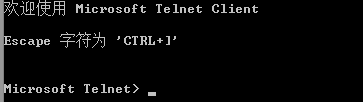 |
   | 3    | 回车，输入GET /http/1.php HTTP/1.1Host:localhost |  |
   | 4    | 两次回车，查看结果                               | 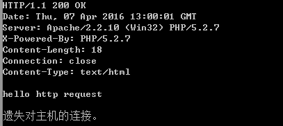 |

   

4. HTTP请求信息和响应信息的格式

   - 请求：请求分为三部分，请求行、请求头信息、请求主题信息。请求行又分为：请求方法、请求路径、所有的协议。

   - 响应：响应分为三部分：响应行，响应头信息、响应主题信息。响应行分为协议版本、状态码，状态文字。

     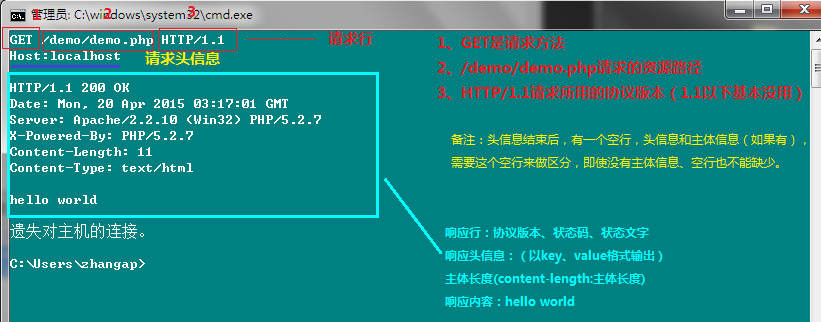

5. 请求方法

   1. GET： 请求指定的页面信息，并返回实体主体。
   2. HEAD： 只请求页面的首部。
   3. POST： 请求服务器接受所指定的文档作为对所标识的URI的新的从属实体。
   4. PUT： 从客户端向服务器传送的数据取代指定的文档的内容。
   5. DELETE： 请求服务器删除指定的页面。
   6. OPTIONS： 允许客户端查看服务器的性能。
   7. TRACE： 请求服务器在响应中的实体主体部分返回所得到的内容。
   8. PATCH： 实体中包含一个表，表中说明与该URI所表示的原内容的区别。
   9. MOVE： 请求服务器将指定的页面移至另一个网络地址。
   10. COPY： 请求服务器将指定的页面拷贝至另一个网络地址。
   11. LINK： 请求服务器建立链接关系。
   12. UNLINK： 断开链接关系。
   13. WRAPPED： 允许客户端发送经过封装的请求。

6. 状态码说明

   1. 客户方错误
      - 100 继续
      - 101交换协议
   2. 成功
      - 200 OK
      - 201 创建
      - 202 接收
      - 203 非认证信息
      - 204 无内容
      - 205 重置内容
      - 206 部分内容
   3. 重定向
      - 300 多路选择
      - 301 永久转移（永久重定向）header("location:http://www.baidu.com",true,301);true表示用301替换302
      - 302 重定向（暂时转移）
      - 303 参见其他
      - 304 未修改（Not Modified） 缓存会用到
      - 305 使用代理
      - 307 重定向中保持原有的请求数据
   4. 客户方错误
      - 400 错误请求（Bad Request）
      - 401 未认证
      - 402 需要付费
      - 403 禁止（Forbidden）
      - 404 未找到（Not Found）
      - 405 方法不允许
      - 406 不接受
      - 407 需要代理认证
      - 408 请求超时
      - 409 冲突
      - 410 失败
      - 411 需要长度
      - 412 条件失败
      - 413 请求实体太长
      - 414 请求URI太长
      - 415 不支持媒体类型
   5. 服务器错误
      - 500 服务器内部错误
      - 501 未实现（Not Implemented）
      - 502 网关失败
      - 504 网关超时
      - 505 HTTP版本不支持

7. 使用telnet进行post请求，需要添加content-type:application/x-www-form-urlencoded和content-length。

8. 配置apache服务器，用于图片防盗链

   - 原理：在web服务器层面，根据http协议的referer的头信息，来判断（url重写）。

   - 步骤：

     1. 打开apache重写模块 mod_rewrite（去掉#号，并重启apache）

        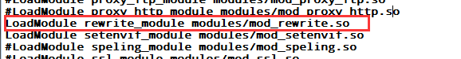

     2. 在需要防盗的网站或目录下，写.htaccess文件。并指定防盗链规则。（把所有的图片都指定到一个指定的路径上）

        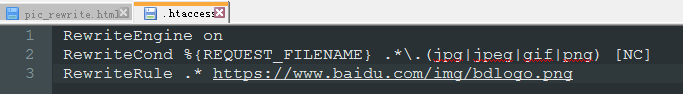

     3. 如果不是来自于localhost的文件，则要进行重写

        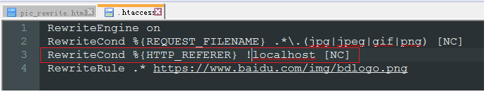

   ​		

9. 缓存的使用

   1. 打开Apache的httpd.conf文件，取消mod_expires.so

      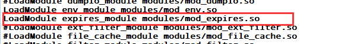

   2. 在.htaccess文件中，添加以下内容

      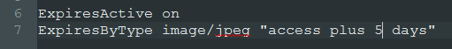

      意思是jpeg的文件缓存五天，然后用浏览器访问，请求返回的的信息如下：

      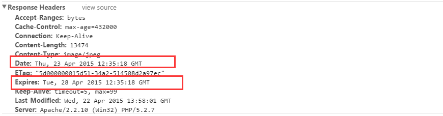

10. 取消缓存的使用（验证码）:

    1. 打开apache中的httpdlconf文件，开启：

       

    2. 在.htaccess文件中加入：

       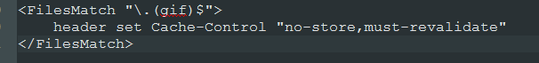

    3. 结果：

       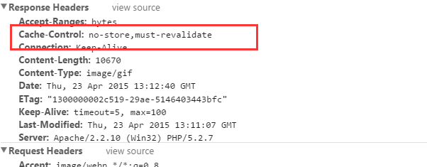

11. telnet发送请求

    Cmd --> telnet localhost 80 --> enter-->ctrl+]-->enter

    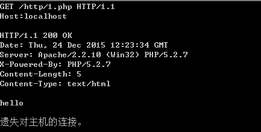

    

    

## 2、HTTP和HTTPS的区别

## 3、HTTP1和HTTP2的区别

# 二、NGINX

## 1、解决css和js不能被删除的问题

因为服务器的缓存机制，旧的css和js并不会被立即删除，这种情况下，需要配合服务器来设置缓存，以nginx为例

```nginx
location / {
    root /home/www/test/dist;
    index index.html;
    try_files $uri $uri/ /index.html;
    add_header Last-Modified $date_gmt;
    add_header Cache-Control 'no-store, no-cache, must-revalidate, proxy-revalidate, max-age=0';
    if_modified_since off;
    expires off;
    etag off;
}
```


## 2、history模式刷新页面404

两种处理方案：

1. ​	404配置的时候，直接重定向到index.html页面
2. location /xxx 配置try_files $uri /xxx/index.html

## 3、Nginx的介绍

### 3.1、为什么要是用Nginx

- 服务端有多态服务器时，客户端到底需要把请求发送给哪台服务器是不确定的。
- 如果所有的客户端把请求都发送给某一台服务器，势必会导致该服务器出现性能瓶颈，甚至是宕机。
- 客户端发送的请求有可能是动态的资源，也有可能是静态资源，需要区分。

### 3.2、Nginx的特点

- 稳定性极强： 7*24
- 提供了非常丰富的配置实例。
- 占用内存小，并发能力强。

### 3.3 、配置文件

核心配置文件

```nginx
user  nginx;
worker_processes  1;

error_log  /var/log/nginx/error.log warn;
pid        /var/run/nginx.pid;
# 以上同城为全局块
# worker_processes的数值越大，Nginx的并发能力就越强
# error_log代表Nginx错误日志存放的位置
# pid是Nginx运行的一个标识

events {
    worker_connections  1024;
}
# events块
# worker_connections的数值越大，Nginx的并发能力就越强

http {
    include       /etc/nginx/mime.types;
    default_type  application/octet-stream;

    log_format  main  '$remote_addr - $remote_user [$time_local] "$request" '
                      '$status $body_bytes_sent "$http_referer" '
                      '"$http_user_agent" "$http_x_forwarded_for"';

    access_log  /var/log/nginx/access.log  main;

    sendfile        on;
    #tcp_nopush     on;

    keepalive_timeout  65;

    #gzip  on;

    include /etc/nginx/conf.d/*.conf;
}

# http块
# include代表引入一个外部文件
# include       /etc/nginx/mime.types;	mime.types中存放着大量媒体类型
#include /etc/nginx/conf.d/*.conf;	引入了conf.d下以.conf为结尾的配置文件
```

常用配置文件：

```nginx
server {
	#代表nginx监听的端口号
	listen 80;
	#代表接收请求的IP
	server_name localhost;
	location ^~ / {
		#将接收到的请求根据配置的目录去查找静态资源
		root	D:/nginx-local/html;
		#默认去下面路径下去查找index.html或index.htm
		index	index.html index.htm;
	}
}
```

## 4、Nginx的反向代理

### 	4.1、正向代理

- 正向代理服务是由客户端设立的。

- 客户端了解代理服务器和目标服务器都是谁。

- 帮助咱们实现突破访问权限，提高访问速度，对目标服务器隐藏客户端的IP地址。

  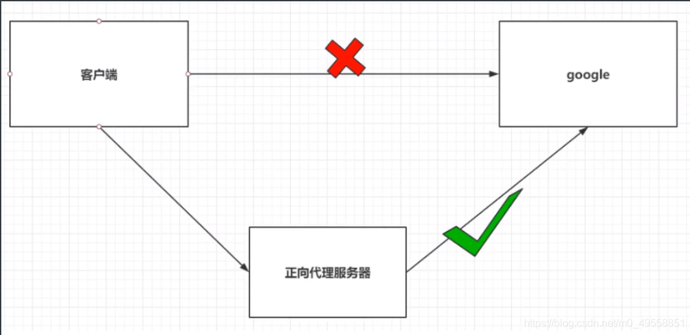

### 4.2、反向代理

- 反向代理服务器是配置在服务器端的。

- 客户端不知道访问的是哪一台服务器。

- 达到负载均衡，并且可以隐藏真正的服务器真正的IP地址。

  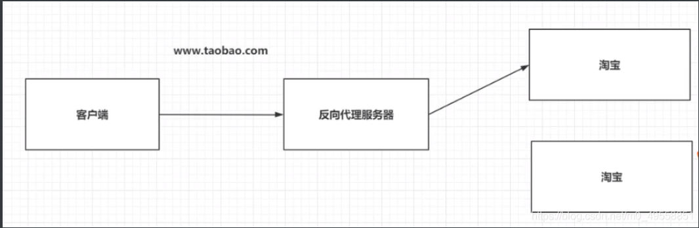

### 4.3、反向代理配置文件

```nginx
server {
	#代表nginx监听的端口号
	listen 80;
	#代表接收请求的IP
	server_name localhost;
	# 基于反向代理访问后台服务
	location / {
		proxy_pass http://192.168.52.47:8080/; 
	}
}
```

### 4.4、location的路径映射

> 优先级关系：
> (location = ) > (location /xxx/yyy/zzz) > (location ^~) > (location ~,~*) > (location /起始路径) > (location /)

------

```nginx
# 1. = 匹配
location / {
	#精准匹配，主机名后面不能带能和字符串
	#例如www.baidu.com不能是www.baidu.com/id=xxx
}
```

```nginx
#2. 通用匹配
location /xxx {
	#匹配所有以/xxx开头的路径
	#例如127.0.0.1:8080/xxx	xxx可以为空，为空则和=匹配一样
}
```

```nginx
#3. 正则匹配
location ~ /xxx {
	#匹配所有以/xxx开头的路径
}
```

```nginx
#4. 匹配开头路径
location ^~ /xxx/xx {
	#匹配所有以/xxx/xx开头的路径
}
```

```nginx
#5. 匹配结尾路径
location ~* \.(gif/jpg/png)$ {
	#匹配以.gif、.jpg或者.png结尾的路径
}
```

配置示例：

```nginx
server {
	#代表nginx监听的端口号
	listen 80;
	#代表接收请求的IP
	server_name localhost;
	# location ^~ / {
	# 	#将接收到的请求根据配置的目录去查找静态资源
	# 	root	D:/nginx-local/html;
	# 	#默认去下面路径下去查找index.html或index.htm
	# 	index	index.html index.htm;
	# }
	# 基于反向代理访问后台服务
	location  = /server1 {
		proxy_pass http://192.168.52.47:8080/;
	}
	location ^~ /server2 {
		proxy_pass http://192.168.52.47:63811/;
	}
	location / {
		proxy_pass http://192.168.52.47:8080/; 
	}
}
```

## 5、Nginx的负载均衡

Nginx默认为我们提供了三种负载均衡策略

1. 轮询： 将客户端发起的请求，平均分配给每台服务器。

   ```nginx
   upstream my-server {
   	server 127.0.0.1:8080;
   	server 127.0.0.1:63811;
   }
   
   server {
   	#代表nginx监听的端口号
   	listen 80;
   	#代表接收请求的IP
   	server_name localhost;
   
   	location / {
   		proxy_pass http://my-server;
   	}
   }
   ```

   

2. 权重：会将客户端的请求，根据服务器的权重值不同，分配不同的数量。

   ```nginx
   upstream my-server {
   	# 基于权重的配置
   	server 127.0.0.1:8080 weight=10;
   	server 127.0.0.1:63811 weight=2;
   }
   
   server {
   	#代表nginx监听的端口号
   	listen 80;
   	#代表接收请求的IP
   	server_name localhost;
   
   	location / {
   		proxy_pass http://my-server;
   	}
   }
   
   ```

   

3. ip_hash: 基于发起请求的客户端的IP地址不同，他始终会将请求发送到指定的服务器上。

   ```nginx
   upstream my-server {
   	# 基于ip_hash的配置
   	ip_hash;
   	server 127.0.0.1:8080 weight=10;
   	server 127.0.0.1:63811 weight=2;
   }
   
   server {
   	#代表nginx监听的端口号
   	listen 80;
   	#代表接收请求的IP
   	server_name localhost;
   
   	location / {
   		proxy_pass http://my-server;
   	}
   }
   
   ```

## 6、Nginx动静分离

Nginx的并发能力公式：

> worker_processes * worker_connections / 4|2 = Nginx最终的并发能力 动态资源需要/4，静态资源需要/2 Nginx通过动静分离来提升Nginx的并发能力，更快的给用户响应。

### 6.1、动态资源代理

```nginx
#配置如下
location / {
  proxy_pass 路径;
}
```

### 6.2、静态资源代理

```nginx
#配置如下
location / {
    root 静态资源路径;
    index 默认访问路径下的什么资源;
    autoindex on;#代表展示静态资源的全部内容，以列表的形式展开
}
```

# 三、安全相关

## 1、白帽子讲安全知识点

1. 安全三要素：

   - 机密性，要求保护数据内容不被泄漏，加密是实现机密性要求的常见手段。
   - 完整性，要求保护数据内容完整，没有被篡改的。常见的保证数据一致性的手段就是数字签名。
   - 可用性，要求保护资源是随需可取。

2. 安全评估的过程：资产等级划分->威胁分析->风险分析->确认解决方案。

3. 互联网安全的核心问题是数据安全问题。

4. 分析安全的途径

   | 威胁     | 定义             | 对应的安全属性 |
   | -------- | ---------------- | -------------- |
   | 伪装     | 冒充他人身份     | 认证           |
   | 篡改     | 修改数据或代码   | 完整性         |
   | 抵赖     | 否认做过的事情   | 不可抵赖性     |
   | 信息泄露 | 机密信息泄露     | 机密性         |
   | 拒绝服务 | 拒绝服务         | 可用性         |
   | 提升权限 | 未经授权获取许可 | 授权           |

   

5. 风险分析需要考虑的方面

   | 等级                        | 高                                             | 中                                         | 低                     |
   | --------------------------- | ---------------------------------------------- | ------------------------------------------ | ---------------------- |
   | Damage Potential（破坏力）  | 获取完全验证权限；执行管理员操作；非法上传文件 | 泄漏敏感信息                               | 泄漏其他信息           |
   | Reproducibility（重复性）   | 攻击者可以随意再次攻击                         | 攻击者可以重复攻击，但是有时间限制         | 攻击者很难重复攻击过程 |
   | Exploitability（可利用性）  | 初学者在短期内掌握攻击方法                     | 熟练的攻击者才能掌握攻击                   | 漏洞利用条件非常苛刻   |
   | Affected users（影响用户）  | 所有用户，默认配置，关键用户                   | 部分用户，非默认配置                       | 极少数用户，匿名用户   |
   | Discoverability（可发现性） | 漏洞很明显，攻击条件很容易获得                 | 在私有区域，部分人能看到，需要深入挖掘漏洞 | 发现漏洞及其困难       |

   

6. 一个优秀的安全方案应该具备以下特点：

   - 能够有效解决问题
   - 用户体验好
   - 高性能
   - 低耦合
   - 易于扩展和升级

7. 安全问题的本质是信任问题，安全方案也是基于信任来做的。

8. 受到同源策略影响的有：

   - DOM
   - COOKIE
   - XMLHttpRequest
   - Flash
   - Java Applet
   - Silverlight
   - Google Gears

9. Google chrome 多进程浏览器，分为以下几个进程：

   - 浏览器进程
   - 渲染进程
   - 插件进程
   - 扩展进程

10. XSS根据效果的不同可以分为如下几类：

    - 反射型：只是简单的把用户输入的数据反射给浏览器，也就是说，黑客往往需要诱导用户用户点击某个恶意链接，才能攻击成功。反射型XSS也叫做“非持久型XSS”。
    - 存储型：会把用户输入的数据存储到服务器端，这种XSS攻击具有很强的稳定性。所以这种攻击也叫做”持久性XSS“。
    - DOM based XSS： 通过修改dom节点形成的XSS。

11. 

# 四、计算机网络

## 1、OSI参考模型对网络拍错的指导

1. 物理层故障
   - 查看连接状态
   - 发送和接收的数据包
2. 数据链路层故障
   - MAC冲突
   - ADSL欠费
   - 两个网卡之间的网速没办法协商
   - 计算机连接到错误的VLAN
3. 网络层故障
   - 配置错误的IP地址
   - 子网掩码
   - 配置错误的网关
   - 路由器上没有配置到达的网络路由
4. 应用层故障
   - 应用程序配置错误
5. 

## 2、OSI参考模型和网络安全

1. 物理层安全：不能随意接入到网络
2. 数据链路层安全：
   - ADSL帐号和密码
   - 数据链路层安全VLAN
   - 交换机端口绑定MAC地址
3. 网络层安全：在路由器上使用ACL控制数据包流量
4. 应用层安全：开发的应用程序没有漏洞

## 3、计算机网络的性能

1. 速率：连接在计算机网络上的主机在数字信道上传送数据位数的速率，也称为data rate 或bit rate。 单位b/s kb/s Mb/s Gb/s。
2. 带宽：数据通信领域中，数字信道所能传送的最高数据量。
3. 吞吐量：在单位时间内通过某个网络的流量。
4. 时延：
   - 发送时延=数据块的长度（比特）/信道带宽（比特/秒）
   - 传播时延
   - 处理时延
   - 排队时延
5. 时延带宽积：传播时延*带宽
6. 往返时间
7. 利用率：
   - 信道利用率
   - 网络利用率：信道利用率加权平均值

# 五、性能问题

## 1、XP+IE8页面卡死解决方案

1. 浏览器设置

   - 打开浏览器，调出菜单栏

   - 工具-internet选线-高级

   - 取消勾选（启用内存保护帮助减少联机攻击），并取消勾选【启动自动崩溃恢复】

     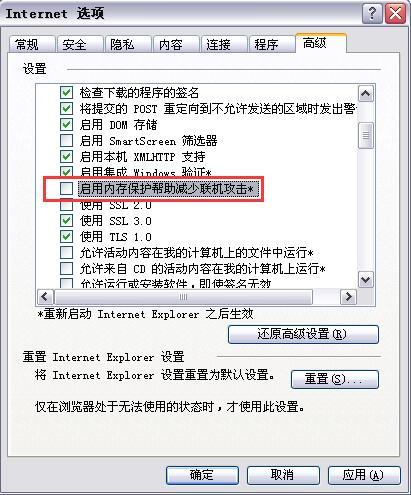

     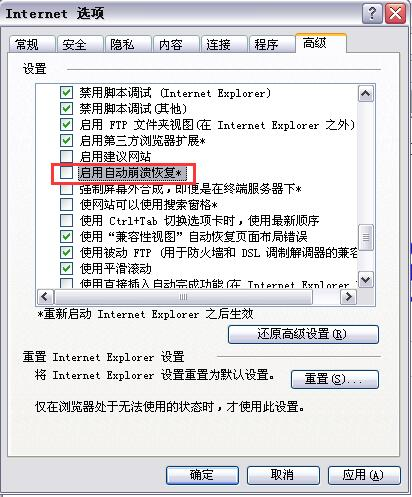

2. 使用Chrome Frame插件，彻底解决浏览器兼容性问题

   - 下载chrome frame插件， 下载地址：http://dl.pconline.com.cn/download/459638-1.html

   - 双击安装

   - 重启IE，在浏览器地址栏中输入：gcf:about:version，出现以下内容，表示安装成功

     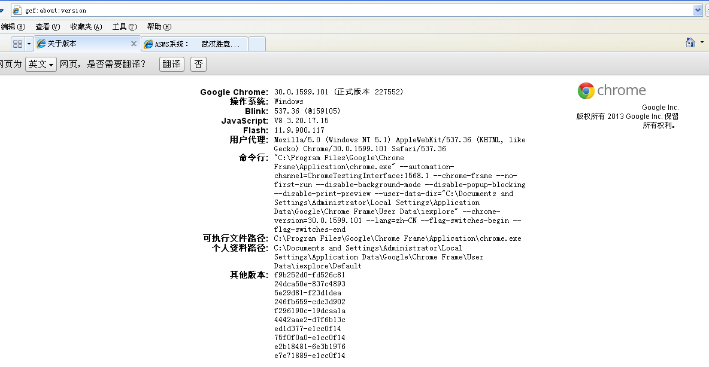

   - 修改页面文件，如下

     ```html
     <meta http-equiv="X-UA-Compatible" content="IE=Edge,chrome=1">
     #以上代码IE=edge告诉IE使用最新的引擎渲染网页，chrome=1则可以激活Chrome Frame.
     ```

   参考文献：http://www.cnblogs.com/xuan52rock/p/6735860.html

## 2、重排（回流）和重绘

repaint就是重绘，reflow就是重排。

严重性：在性能优先的前提下，重排的性能消耗大于重绘。重排一定会触发重绘，但是重绘不一定会触发重排。

体现：repaint是对某个dom元素进行重绘，reflow是对真个页面进行重排，也就是页面所有DOM重新渲染。

如何触发：style变动造成的重绘和重排

1. 不涉及任何dom元素的排版问题的变动，都是repaint。例如元素的color/text-align/text-decoration等属性的变动。
2. 除上面提到的DOM的style的修改，其他的修改基本为reflow。例如元素的width/height/line-height/boder/display等的修改。

常见的触发场景：

- repaint
  1. color的需改
  2. text-align的修改
  3. a:hover也会造成重绘
  4. :hover引起的颜色等不导致页面回流style的变动
- reflow
  1. width/height/border/margin/padding的修改
  2. 动画，：hover等伪类等引起的元素表现的改动，display=none等造成的页面的回流
  3. appendChild/insertBefore/removeChild等DOM元素的操作
  4. font类style的修改
  5. background的修改，字面上可能是重绘，实际上浏览器进行了重排，经过浏览器厂家的优化，部分background的修改只触发了repaint。
  6. scroll页面
  7. resize页面。浏览器的放大和缩小。
  8. 读取元素的属性。offsetLeft/offsetTop等。

如何规避：

1. 尽可能在DOM末梢通过改变class来修改style属性，尽可能减少受影响的DOM元素。
2. 避免设置多项内联样式，使用常用的class方式进行样式的设置，以避免设置样式时访问DOM的低效率。
3. 设置动画元素的属性为position/fixed，由于当前元素从DOM流中独立出来，因此受影响的只有当前的DOM元素，元素repaint。
4. 牺牲平滑度满足性能，动画精度太强，会造成多次的reapint/reflow。牺牲精度，能满足性能的损耗，获取性能和平滑度的平衡。
5. 避免使用table布局，table的每个元素的大小和内容的变动，都会导致整个table重新计算，造成大幅度的repaint和reflow。改用div则可以进行针对性的repaint和避免不必要的reflow。
6. 避免在css中使用运算式，学习css的时候就知道，整个应该避免，不应该加深到这一层再去了解，因为这个的后果确实很严重。一旦存在动画的repaint活着是reflow,那么每一帧动画都会重新计算，性能不容小觑。


## 3、优化手段

1. DOM的多个读操作或者是写操作应该放在一起，不要两个读操作之间，夹一个写操作。
2. 如果某个样式是通过重排得到，最好是缓存结果。避免下次再使用时，又造成浏览器的重排。
3. 不要一条条的改变样式，最好是通过class或者是cssText一次性来改变样式。
4. 尽量使用离线DOM而不是真实的DOM来改变元素的样式。比如DocumentFragment对象，完成以后，再把这个对象加入到DOM中。再比如，使用cloneNode()方法，克隆某个节点，并在克隆的节点上进行操作。然后再用克隆的节点替换原始节点。
5. 先将DOM display为none，然后对节点操作，最后再显示节点（不可见的元素不影响重绘和重排）。
6. 使用虚拟DOM脚本库。如react/vue。
7. position属性为absolute或fixed的元素，重排的开销会比较小，因为不用考虑它对其他元素的影响。
8. 使用window.requestAnimationFrame()、window.requestIdleCallback()这两个方法调节重新渲染。
9. 如果在同一个函数中需要多次读取同一个对象的属性，最好将入存到一个局部变量中，以局部变量代替属性，避免多余的属性查找带来的性能开销。
10. 除非你要迭代遍历一个属性未知的对象，否则不要使用for-in循环。
11. 一般来说，switch总比if-else更快，但并不总是最好的解决方案。

# 六、CDN

## 1、利用多个域名来存储网站资源的优势

1. CDN缓存更方便，且CDN主要用来使用户就近获取资源。
2. 突破浏览器并发限制，同一时间针对同一域名下的请求有一定数量的限制。超过限制的数目请求会被阻塞（并发数量控制在6）。
3. Cookieless,节省带宽，尤其是上行带宽一般比下行带宽慢。
4. 对于UGC的内容和主站隔离，防止不必要的安全问题。
5. 数据做了划分，甚至切换到不同的物理集群，通过子域名来分流比较省事。

