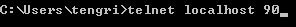

# 一、HTTP协议

1. URI（统一资源标识符）由两部分组成

   1. URL（统一资源定位符）
   2. URN（统一资源名）

2. URL格式包含三部分内容

   1. schema（方案），说明了访问资源的类型，如HTTP协议、HTTPS协议。
   2. 服务器因特网地址，如www.baidu.com
   3. web服务器上的某个资源。（/image/logo.png）

3. 利用Telnet模拟浏览器发送一个请求。

   | 序号 | 步骤                                             | 截图                              |
   | ---- | ------------------------------------------------ | --------------------------------- |
   | 1    | cmd打开docs窗口、输入telnet localhost 90         |  |
   | 2    | 回车，然后输入CTRL+]                             |  |
   | 3    | 回车，输入GET /http/1.php HTTP/1.1Host:localhost |  |
   | 4    | 两次回车，查看结果                               |  |

   

4. HTTP请求信息和响应信息的格式

   - 请求：请求分为三部分，请求行、请求头信息、请求主题信息。请求行又分为：请求方法、请求路径、所有的协议。

   - 响应：响应分为三部分：响应行，响应头信息、响应主题信息。响应行分为协议版本、状态码，状态文字。

     

5. 请求方法

   1. GET： 请求指定的页面信息，并返回实体主体。
   2. HEAD： 只请求页面的首部。
   3. POST： 请求服务器接受所指定的文档作为对所标识的URI的新的从属实体。
   4. PUT： 从客户端向服务器传送的数据取代指定的文档的内容。
   5. DELETE： 请求服务器删除指定的页面。
   6. OPTIONS： 允许客户端查看服务器的性能。
   7. TRACE： 请求服务器在响应中的实体主体部分返回所得到的内容。
   8. PATCH： 实体中包含一个表，表中说明与该URI所表示的原内容的区别。
   9. MOVE： 请求服务器将指定的页面移至另一个网络地址。
   10. COPY： 请求服务器将指定的页面拷贝至另一个网络地址。
   11. LINK： 请求服务器建立链接关系。
   12. UNLINK： 断开链接关系。
   13. WRAPPED： 允许客户端发送经过封装的请求。

6. 状态码说明

   1. 客户方错误
      - 100 继续
      - 101交换协议
   2. 成功
      - 200 OK
      - 201 创建
      - 202 接收
      - 203 非认证信息
      - 204 无内容
      - 205 重置内容
      - 206 部分内容
   3. 重定向
      - 300 多路选择
      - 301 永久转移（永久重定向）header("location:http://www.baidu.com",true,301);true表示用301替换302
      - 302 重定向（暂时转移）
      - 303 参见其他
      - 304 未修改（Not Modified） 缓存会用到
      - 305 使用代理
      - 307 重定向中保持原有的请求数据
   4. 客户方错误
      - 400 错误请求（Bad Request）
      - 401 未认证
      - 402 需要付费
      - 403 禁止（Forbidden）
      - 404 未找到（Not Found）
      - 405 方法不允许
      - 406 不接受
      - 407 需要代理认证
      - 408 请求超时
      - 409 冲突
      - 410 失败
      - 411 需要长度
      - 412 条件失败
      - 413 请求实体太长
      - 414 请求URI太长
      - 415 不支持媒体类型
   5. 服务器错误
      - 500 服务器内部错误
      - 501 未实现（Not Implemented）
      - 502 网关失败
      - 504 网关超时
      - 505 HTTP版本不支持

7. 使用telnet进行post请求，需要添加content-type:application/x-www-form-urlencoded和content-length。

8. 配置apache服务器，用于图片防盗链

   - 原理：在web服务器层面，根据http协议的referer的头信息，来判断（url重写）。

   - 步骤：

     1. 打开apache重写模块 mod_rewrite（去掉#号，并重启apache）

        

     2. 在需要防盗的网站或目录下，写.htaccess文件。并指定防盗链规则。（把所有的图片都指定到一个指定的路径上）

        

     3. 如果不是来自于localhost的文件，则要进行重写

        

   ​		

9. 缓存的使用

   1. 打开Apache的httpd.conf文件，取消mod_expires.so

      

   2. 在.htaccess文件中，添加以下内容

      

      意思是jpeg的文件缓存五天，然后用浏览器访问，请求返回的的信息如下：

      

10. 取消缓存的使用（验证码）:

    1. 打开apache中的httpdlconf文件，开启：

       

    2. 在.htaccess文件中加入：

       

    3. 结果：

       

11. telnet发送请求

    Cmd --> telnet localhost 80 --> enter-->ctrl+]-->enter

    

# 二、NGINX

## 1、解决css和js不能被删除的问题

因为服务器的缓存机制，旧的css和js并不会被立即删除，这种情况下，需要配合服务器来设置缓存，以nginx为例

```nginx
location / {
    root /home/www/test/dist;
    index index.html;
    try_files $uri $uri/ /index.html;
    add_header Last-Modified $date_gmt;
    add_header Cache-Control 'no-store, no-cache, must-revalidate, proxy-revalidate, max-age=0';
    if_modified_since off;
    expires off;
    etag off;
}
```


## 2、history模式刷新页面404

两种处理方案：

1. ​	404配置的时候，直接重定向到index.html页面
2. location /xxx 配置try_files $uri /xxx/index.html

# 三、安全相关

# 四、计算机网络

# 五、性能问题

