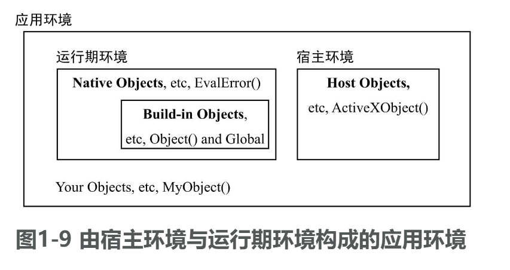
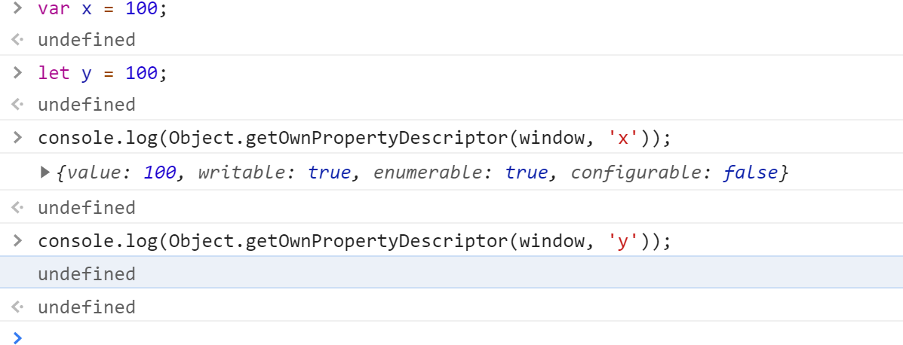
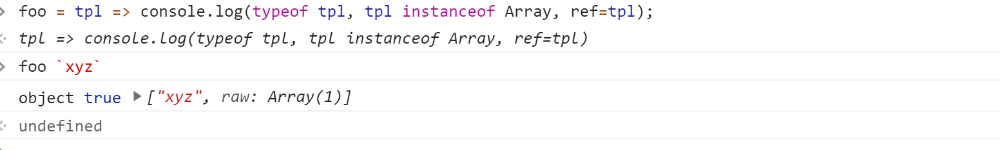
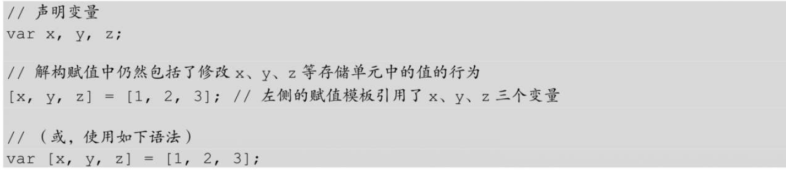
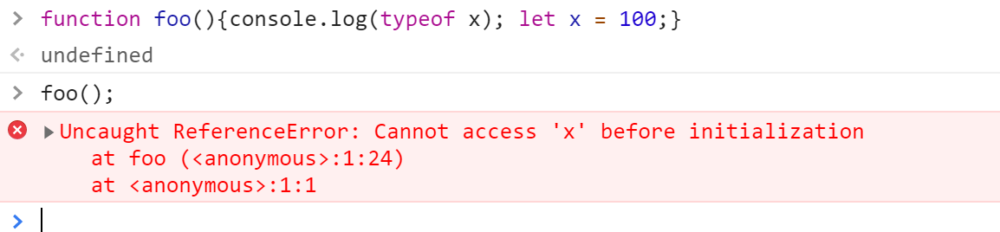
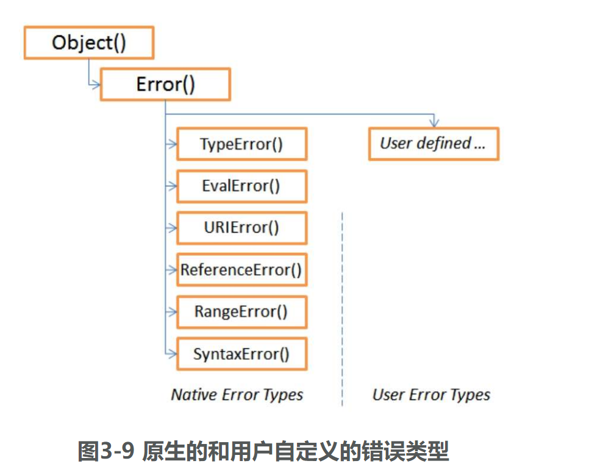

# 《JavaScript语言精髓和编程实战》

程序设计语言总是有三种基本性质：语法、语义与语用。

1. 语法：是指我们表达内容的形式。

2. 语义：是指我们表达内容的逻辑含义。语义有以下基本特质：
   - 必须是一个含义
   - 该含义必须能够以某种基本的逻辑形式予以阐述。
   - 该逻辑所表达的含义可以为语言的接受者所知。（非基本特质）
   
3. JavaScript的应用环境，主要包含了宿主环境与运行期环境构成。

   

   ​	运行期环境特指由引擎创建的初始环境：

   - ​	一个对宿主的约定
   - 一个引擎内核
   - 一组对象和API
   - 一些其他的规范

4. 语法关键字是对语义逻辑绑定的结果，是对作用域的限定；变量是对位置性质的绑定结果，则是对变量生存周期的限定。

5. 识别语法错误与运行错误：一般来说，JavaScript引擎会在代码装入时先进行语法分析，如果语法分析通不过，整个脚本代码块都不执行；当语法分析通过时，脚本代码才会执行。若在执行过程中出错，那么在同一代码上下文中、出错点之后的代码将不再执行。

6. 基于类型系统的运算中：

   - 一般表达式运算的结果总是值
   - 函数、方法调用的结果可以返回值类型，也可以返回引用类型。
   - 值与引用、值与值之间即使相等（==），也不一定严格相等（===）。
   - 两个引用之间如果相等（==），则一定严格相等（===）。

7. let声明变量和var声明变量的区别：

   1. 作用域：var声明的变量，其作用域为当前函数、模块或全局；let声明变量，其作用域总是在当前代码块，例如语句块。
   2. 重复申明：在同一个代码块中，var可以多次声明同一个变量名，在语法分析中和声明一次没有区别；let只能声明一次，重复声明会导致语法错误。
   3. 对变量的使用：var声明的变量，可以使用在前，其值为undefined；let必须是先声明后使用，声明之前使用会触发异常，这也会导致typeof成为一个不安全的运算。
   4. 全局声明：使用var在全局声明一个变量，相当于在全局对象global（window）上声明了一个属性，进而使得所有代码都能将这些声明作为全局变量来访问；let声明全局变量，始终遵从“块级作用域”规则，因此即使出现在全局代码块中，它们也只是声明为“全局作用域”中的标识符，而不是作为global对象上的属性。如下：

   

8. 模板字面量本质来说是一个字面量的引用-该字面量在JavaScript内部表达为一个对象（array-like-object）或数组。

   

9. 逻辑或和逻辑与既不改变操作数的操作类型，也不强制运算结果的数据类型。除此之外，还有以下两条特性：

   - 运算符会将操作数隐士转换为布尔值，以进行布尔运算。
   - 运算过程（与普通布尔运算一样）是支持布尔短路的。

10. 将字符串作为类似数组的对象，可以用下标去访问，但是不能通过该运算去修改该字符串的值。

11. 从ES6开始，字符串又被添加了Symbol.iterator属性，它可以作为可迭代对象处理，例如，接受数组展开以及yield*等运算（以及for...of语句）。

12. JavaScript总是尽量用数字值比较来实现等值检测，这主要是因为JavaScript内部的数据存储格式适合这一操作。同样的原因（出于内部存储格式的限制），字符串检测通常会存在非常大的开销。

13. 赋值运算对值类型来说是复制数据，而对于引用类型来说，则只是复制一个地址。这里存在两个特例：

    1. 值类型的字符串是一个大的，不确定长度的连续数据块，这导致复制数据的开销很大，所以在JS中将字符串的赋值也变成了复制地址，该字符串（连续数据块起始处）的地址引用。由此引入了三条字符串的限制：

       - 不能直接修改字符串中的字符。
       - 字符串连接运算必然导致写复制，这将产生新的字符串。
       - 不能改变字符串的长短，例如，修改length属性是无意义的。

    2. 在ES6之后的解构赋值中，赋值运算符的语义并不只有“复制地址/复制引用”，还包括“解析数组或对象的成员”这一行为。在具体到向赋值模板中复制这些成员的值（或引用）时，仍然是“赋值的效果是修改存储单元的值”。

       

14. new functionReference(), 在语法中，functionReference后面的括号并不是函数调用运算符，而只是new运算符语法的参数传入表（这是因为，在这一语法中决定或启动函数调用的是new运算符而非这对括号。不过在少数情况下，new运算符会被用作隐士的函数调用）。

15. typeof是运算符，而不是语法关键字。但是在ES6之后，一个标识符不再是简单的有或者是没有，而typeof也就不总是安全的。因此与使用var变量不同的是，当typeof操作一个“使用let/const声明但未绑定值”的名字时，将就抛出一个异常。

    

16. 模块加载方式：

    - 简单装载：module.js中没有提供任何export语句，此时可用(只能使用) import 'module.js'。如果使用import xxx from 'module.js',会报错。
    - 命名导入：import defaultExport from 'moduleName'; import {importList} from 'moduleName'。
    - 命名空间导入： import * as  someNameSpace from 'moduleName'。

17. 装载模块意味着模块中的顶层代码会被执行一次，由于引擎的模块装载系统会静态扫描全部模块并确定装载的次序，所以事实上模块名“import”语句中出现和被依赖的次序也就成了那些顶层代码得以执行的次序。

18. 所有模块的顶层代码都是顺序的、串行的执行。

19. 有7种语法在严格模式中被禁用，但是在旧的ECMAScript版本中，它们是合法的。

    - 在对象字面量声明中存在相同的属性名。
    - 在函数声明中，参数表中带有相同的参数名。
    - 不能声明或重写eval和arguments这两个标识符。同时，这两个标识符也不能是用delete进行删除。
    - 用0前缀声明的8进制字面量。
    - 用delete删除显示声明的标识符、名称或具名函数。
    - 在代码中使用一些扩展的保留字，这些保留字包括implements、interface、let、packaage、private、protected、public、static、以及yield等。
    - 在代码中包含with语句。
    
20. 加号的二义性

    1. 表示字符串连接。（如果表达式中有字符串，则优先按字符串连接进行计算）
    2. 数字取正值的一元运算符
    3. 表达式的求和。

21. 括号的二义性

    1. 函数声明中的虚拟参数表。
    2. 传值参数表，并不表达函数调用的含义（只出现在new 关键字的使用中）。
    3. 可以在with、for、if、while和do...while等语句，以及catch（）等子句中用来作为限定表达式的词法元素。
    4. 可用于强制表达式运算。
    5. 作为函数、方法调用运算符。
    6. **函数调用过程中的括号“（）”是运算符。也因此得出推论，当“（）”作为运算符时，它只作用于表达式运算，而不可能作用于语句。**

22. 冒号的二义性

    1. 声明对象字面量的成员和声明标签。
    2. 在switch语句中声明一个分支。
    3. 在三元表达式中，表示条件为false时的表达式分支。

23. 大括号的二义性（所有的作用都是作为语法和词法符号来是用的）

    1. 复合语句（标签后的复合语句、条件分支后的复合语句）。
    2. 声明对象字面量
    3. 函数的声明
    4. 结构化异常。 try{}catch(){}finally{}
    5. 模板中的变量引用
    6. 解构赋值

24. Javascript中为面向对象设计的语法元素

    | 类型       | 语法元素    | 含义                       |
    | ---------- | ----------- | -------------------------- |
    | 字面量声明 | ｛...｝     | （一般）对象               |
    |            | [...]       | 数组对象                   |
    |            | /.../       | 正则表达式对象             |
    | 类的声明   | class       | 声明类                     |
    |            | constructor | 声明构造方法               |
    |            | get         | 声明属性取值方法           |
    |            | set         | 声明属性设置方法           |
    |            | methodName  | 声明方法                   |
    | 运算符     | new         | 创建指定类的对象实例       |
    |            | instanceof  | 检查变量是否是指定类的实例 |
    |            | delete      | 删除实例属性               |
    |            | .           | 存取对象成员（属性、方法） |
    |            | []          | 存取对象成员（属性、方法） |
    |            | in          | 检查对象属性               |
    | 语句       | for...in    | 列举对象成员名             |
    |            | for...of    | 列举数组成员值             |
    |            | with        | 设定语句默认对象           |
    | 其他       | super       | 类声明中引用父类           |
    |            | new.target  | 构造器函数中引用构造器自身 |
    |            | this        | 在上下文中指向当前对象实例 |
    
25. 每个对象都有一个propertyIsEnumerable方法。此方法可以确定对象中指定的属性是否可以被for...in循环枚举，但是通过原型继承的属性除外。如果对象没有指定属性，则此方法返回false。

26. for...of可以列举带所有迭代器的对象（可迭代对象），而不论它们是否是集合或者是数组。如字符串。

27. JS是用in运算来检查对象是否具有某个成员（包括显示的和隐士的，也包括符号作为键名的属性）。

28. delete可以删除全局变量，但是用var/const/let声明的变量是不能被删除的。

29.  JavaScript确保即使用户代码在多个地方调用Symbol.for(),也有且仅有第一次调用时会创建（并返回）符号，而此后的调用都将直接返回该符号。这种内建机制保证了这些符号的全局唯一。

30. 子类必须具有父类的特性。这也是JS中不能用delete删除从父类继承来的成员的原因。尽管这看起来是“自由属性表”带来的特性，但是他确保了在重写成员、改变它的实现等的同时，在界面上保持与父类的必然一致性。

31. JavaScript原型继承的实质便是对原型修改“效果的传递”，它基于以下两个事实。

    - 原型：原型是一个对象。
    - 原型链：在访问属性时，如果子类对象没有该属性，则将访问其原型的属性表。
    
32. 在声明中使用了extends关键字，所以在构造器中必须调用super()。

33. 函数中所关联的this引用，有三个规则来决定：

    - 使用当前上下文中的this或函数已绑定的this。
    - 在使用属性存取运算符（包括.和[]）时将左操作数作为this传入。
    - 使用Function.call, Function.apply,Functoin.bind或Reflex.apply等，将指定参数传入以用来作为this引用。

34. 当一个函数在调用时得到的this值是undefined或null时，那么如果函数工作在严格模式下，则仍然使用undefined或null值作为this；否则将以全局对象作为this的值。

35. 箭头函数的特性：

    1. 相较于函数表达式，箭头函数具有更简洁的语法。
    2. 没有单独的this：箭头函数没有自己的this，只会根据从自己的作用域链的上一层继承this。
    3. 使用apply、call和bind并不能改变this指向。通常第一个参数会忽略。
    4. 不绑定arguments对象，在大多数情况下，使用剩余参数是更好的选择。
    5. 不能用作构造器，和new一起用会抛出错误。
    6. 没有prototype属性。
    7. yield关键字通常不能在箭头函数中使用（除非是嵌套在允许使用的函数内）。因此，箭头函数不能用做函数生成器。
    8. 箭头函数内部不能直接返回对象字面量，需要用括号括起来。
    9. 箭头函数在参数和箭头之间不能换行。

36. 类抄写的几个问题：

    1. 所有的方法都写在构造函数中，每次构造的实例之间，他们的方法并不是同一个函数，这意味着更多的内存开销。
    2. 类抄写的所有属性都是在实例的自有属性表中，访问任何成员都不必回溯到原型链，因而效率更高。
    3. 并不维护原型继承链。所以不能用instanceof运算来检测继承关系。
    4. 总之，类抄写并没有利用原型继承的任何特性。

37. 原型继承的缺陷：

    1. 在维护构造器引用和外部原型链之间无法平衡。
    2. 没有提供调用父类方法的机制。
    3. 继承层次中的邻近成员访问更快，而试图访问一个不存在的成员耗时最久。

38. 类继承倾向于在基类中实现更基础、更稳定和更通用的对象性质、以减轻在子类和最终实例上实现逻辑的负担。

39. 常见的错误类型：

    

40. JavaScript的数组是异质、交错和稀疏的，可以存在不连续的下标（元素为undefined的空洞）以及保存任意类型的元素。

41. 数组由于存储的不连续性，以及元素的不一致性，因而有着巨大的性能问题，所以JavaScript也提供了类型化数组（TypedArray）来高效处理地址连续、成员结构化的集合。其中copyWithin、fill、set、sort、reverse五个方法可以影响元素的值。

42. 代理机制并不改变原始对象自己的操作，只能响应“在代理对象上发生的”行为。

    ```javascript
    var obj = {
        value: 100
    };
    var p = new Proxy(obj, {
        get(target,key) {
            console.log('代理get方法被执行');
            return target[key] * 2;
        }
    });
    // 返回100
    console.log(obj.value);
    // 返回200
    console.log(p.value);
    ```

43. 属性按照它的描述符的不同，可以分为以下两类：

    - 数据属性
    - 存取属性：用get/set定义的属性。

44. 属性的**性质**是不可继承的。

45. 在严格模式中向未声明的变量赋值是被禁止的。

46. 所有模块的顶层代码都是顺序的、串行地执行的。顶层的文件是由引擎装入并被称为主模块，它是逻辑上所有代码的入口。

47. 在严格模式下，有七种语法是被限制的（语法限制）：

    1. 在对象字面量声明中存在相同的属性名。
    2. 在函数声明中，参数表中带有相同的参数名。
    3. 不能声明或重写eval和arguments这两个标识符。
    4. 用0前缀声明的八进制字面量在严格模式下也是不允许的。
    5. 用delete删除显示声明的标识符、名称或具名函数。
    6. 在代码中使用一些扩展的保留字、这些保留字包括implements、interface、let、package、private、 protected、public、static、以及yield。
    7. 在代码中包括with语句。

48. 执行限制（严格模式）

    1. 在严格模式下向下不存在的标识符赋值导致引用异常（ReferenceError）。

    2. 在运算符处理一些不可处理的操作数时，将导致类型异常或语法错误。
       1. 当对象是不可扩展的（isExtensible为真）时，向不存在的属性赋值。
       2. 当对象是不可删除的属性（isSealed或isFrozen为真）时，尝试删除属性。
       3. 删除某些不能删除的系统属性，标识符、或configurable性质为false的属性。
       4. 写只读属性
       5. 写常量（const定义的常量，重新赋值时，会存在此情况）
       
    3. 访问arguments.callee或函数的caller属性将导致类型异常。

    4. 以下代码的执行效果与非严格模式并不一致。

       ```javascript
       'use strict';
       function foo(x){ 
           arguments[0] = 100; 
           return x;
       }
       foo('abc');
       // 在严格模式下，返回的是abc、在非严格模式下，返回的是100
       
       ```

49. 有限范围下的严格模式

    1. 如果指示前缀在js文件最前面，对后面的所有代码都有影响。
    2. 如果指示前缀在函数内部，只对当前函数有影响。
    3. 如果指示前缀出现在代码中间作为一个字面量表达式语句时，那么它将被忽略。

# 《JavaScript高级程序设计（第四版）》

## HTML中的JavaScript

1. 要包含外部的JavaScript，必须将src属性设置为要包含文件的URL。文件可以跟网页在同一台服务器上，也可以位于完全不同的域。
2. 所有的<script>元素会依照他们在网页中出现的次序被解释，在不使用defer和async属性的情况下，包含在<script>元素中的代码必须严格按照次序解释。
3. 对不推迟执行的脚本，浏览器必须解释完位于<script>元素中的代码，然后才能继续渲染页面剩余的部分。为此，通常应该把<script>元素放到页面末尾，介于主内容只有以及</body>标签之前。
4. 可以使用defer属性把脚本推迟到文档渲染完毕后再执行。推迟的脚本原则上按照它们被列出的次序执行。
5. 可以使用async属性表示脚本不需要等待其他脚本，同事页不阻塞文档渲染，即异步加载。 异步脚本不能保证按照它们在页面中出现的次序执行。
6. 通过使用<noscript>元素，可以按照他在浏览器不支持脚本时显示的内容。如果浏览器支持并启用脚本，则<noscript>元素中的任何内容都不会被渲染。

## 语言基础

1. let和var声明变量的区别：
   1. 作用域不同：var是函数作用域，let是块级作用域。
   2. 变量提升：var声明变量会有变量提升、let不会有变量提升。此特性导致在声明之前使用变量时，var声明的会是undefined，let会有暂时性死区的问题。
   3. 冗余申明：var可以多次声明同名变量，最后声明的覆盖前面的同名变量，let不能重复声明。
   4. 全局声明：var在全局作用域中申明的变量，会挂载到window上，let在全局作用域中声明的变量，不会有此问题。
   5. 条件声明：在使用var声明变量时，由于声明会被提升，JavaScript引擎会自动将多余的声明在作用域顶部合并为一个声明。因为let的作用域是块，所以不可能检查前面是否已经使用let声明过同名变量，同时也就不可能在没有声明的情况下声明它。
   6. for循环：var定义的迭代变量会渗透到到循环体外部；let声明的仅限于循环体内部。且let声明迭代变量时，JavaScript引擎在后台会为每个迭代循环声明一个新的迭代变量。所以延迟使用迭代变量时，不会有覆盖的情况出现。
   
2. parseInt函数更专注于字符串是否包含数值模式。如果第一个字符不是数值字符、加号或减号、parseInt会立即返回NaN。相反，Number('')会返回0。

3. 字符串的特点：ECMAScript中的字符串是不可变的，意思是一旦创建、他们的值就不能变了。要修改某个变量中的字符串值，必须先销毁原始的字符串，然后将包含新值的另一个字符串保存到该变量中。（这也是早期各个浏览器在拼接字符串时比较慢的原因）

4. 转换为字符串的方式：

   1. toString方法、返回当前值的字符串等价物。默认情况下，toString方法是不接收任何参数的，但是如果是对数值调用此方法时，可以接收一个底数参数，表示以什么底数来输出数值的字符串表示。（2/8/10/16）
   2. 因为null和undefined没有toString方法，所以可以采用String()转型函数，它始终会返回表示相应类型的字符串。String()函数遵循如下规则：
      1. 如果值有toString方法，则调用方法（不传参）并返回结果。
      2. 如果值是null，则返回‘null’。
      3. 如果值是undefined，则返回'undefined'。

5. 模板字面量特点：

   1. 模板字面量保留换行字符。

   2. 可以跨行定义字符串。（如果需要定义html模板时，非常有用）

   3. 支持字符串插值，且所有的插入的值都会使用toString()强制转换为字符串，而且任何JavaScript表达式都可以用于插值。

   4. 模板字面量标签函数。

      ```javascript
      let a = 6;
      let b = 9;
      
      function simpleTag(strings, aExpression, bExpression, sumExpression){
        console.log(strings);
        console.log(aExpression);
        console.log(bExpression);
        console.log(sumExpression);
        return '这个是标签函数';
      }
      
      let result = `${a}+${b}=${a + b}`;
      console.log(result);
      let result2 = simpleTag`${a}+${b}=${a + b}`;
      console.log(result2);
      
      
      // 6+9=15 debugger eval code:13:9
      // Array(4) [ "", "+", "=", "" ]
      // debugger eval code:5:11
      // 6 debugger eval code:6:11
      // 9 debugger eval code:7:11
      // 15 debugger eval code:8:11
      // 这个是标签函数
      ```

   5. 原始字符串：使用模板字面量也可以直接获取原始的模板字面量内容（如换行符活Unicode字符），而不是被转换后的字符表示。为此，可以使用默认的String.raw标签函数。

      ```javascript
      console.log(`\u00A9`)
      console.log(String.raw`\u00A9`);
      ```

      

   6. Object实例都有以下属性和方法。

      1. constructor：用于创建当前对象的函数。
      2. hasOwnProperty(propName)：用于判断当前对象实例（不是原型）上是否存在给定的属性。要检查的属性名必须是字符串或符号。
      3. isPropertypeOf(object)：用于判断当前对象是否为另一个对象的原型。
      4. propertyIsEnumerable(propName)：用于判断给定的属性是否可以使用for-in语句枚举。
      5. toLocalString()：返回对象的字符串表示，该字符串反应对象所在本地化执行环境。
      6. toString()：返回对象的字符串表示。
      7. valueOf()：返回对象对应的字符串、数值或布尔值表示。

   7. 一元加和减操作符（+）表示，放在变量前头、对数值类的变量没有任何影响。如果将一元加应用到非数值，则会执行与使用Number（）转型函数一样的类型转换： 布尔值false和true转换为0和1，字符串根据特殊规则进行解析，对象会调用它们的valueOf()或toString()方法以得到可以转换的值。
   
   8. 按位非操作符用（~）表示，它的作用是返回数值的一个补数。实际上按位非的最终效果是对数值取反并减去1。位操作是在数值的底层表示上完成的，所以位操作的速度快很多。
   
   9. 逻辑与并不一定会返回布尔值，而是遵循如下规则：
   
      1. 如果第一个操作数是对象，则返回第二个操作数。
      2. 如果第二个操作数是对象，则只有第一个操作数求值为true才会返回该对象。
      3. 如果两个操作数都是对象，则返回第二个操作数。
      4. 如果有一个操作数是null，则返回null。
      5. 如果有一个操作是NaN,则返回NaN。
      6. 如果有一个操作数是undefined，则返回undefined。
   
   10. 逻辑或遵循如下规则：
   
       1. 如果第一个操作数是对象，则返回第一个操作数。
       2. 如果第一个操作数求值是false，则返回第二个操作数。
       3. 如果两个操作数都是对象，则返回第一个操作数。
       4. 如果两个操作数都是null,则返回null。
       5. 如果两个操作数都是NaN,则返回NaN。
       6. 如果两个操作数都是undefined，则返回undefined。
   
   11. 加号操作符遵循以下规则：
   
       1. 如果两个操作数都是字符串，则将第二个字符串拼接到第一个字符串后面。
       2. 如果只有一个操作数是字符串，则将另一个操作数转换为字符串，再将两个字符串拼接在一起。
   
   12. 关系操作符遵循规则：
   
       1. 如果两个操作数都是数值，则执行数值比较。
       2. 如果两个操作数都是字符串，则逐个比较字符串中对应字符的编码。（大写字母的编码都是小于小写字母的编码），所以如果要按字母顺序来判定两个字符串的大小，则需要将两个字符串统一转换为大写或者是小写。
       3. 如果有任一操作数是数值，则将另一个操作数转换为数值，执行数值比较。
       4. 如果有任一操作数是对象，则调用其valueOf()方法，取得结果后再根据前面的规则执行比较。如果没有valueOf()方法，则调用toString()方法，取得结果后再根据前面的规则进行比较。
       5. 如果有任一操作数是布尔值，则将其转换为数值再执行比较。
   
   13. switch语句在比较每个条件的值时会使用全等操作符，因为不会强制转换数据类型（比如0和‘0’是不相等的）。
   
   14. 对于函数返回值，最佳实践是，要么返回值，要么不返回值。只有在某个条件下返回值的函数会带来麻烦，尤其在调试时。
   
   15. 在严格模式下，对函数也有一定的要求：
   
       1. 函数不能以eval或arguments命名。
       2. 函数的参数不能叫eval或arguments。
       3. 两个命名参数不能拥有同一个名称。
       
   16. 开发实践表明，应该尽可能多的使用const声明，除非确实需要一个将来会重新赋值的变量。这样可以从根本上保证提前发现重新赋值导致的bug。
   
   17. 标识符查找并非没有代价，访问局部变量比访问全局变量要快，因为不用切换作用域。虽然JavaScript引擎在优化标识符查找上做了很多工作，但是平时在写代码的时候，可以从这个角度去进行优化。
   
   18. 垃圾回收的两种策略：标记清理和引用计数。标记清理是JavaScript最常用的垃圾回收策略。引用计数的问题：循环引用，所谓循环引用，就是对象A有一个指针指向对象B，而对象B也引用了对象A。这就导致函数执行完毕，对象内存无法释放，函数执行次数越多，内存占用越大，最后导致内存溢出。所以为了避免循环引用问题，应该确保在不使用的情况下切断原生JavaScript对象与DOM元素之间的链接（把变量设置为null）。
   
   19. 垃圾回收程序会周期性的运行，如果内存中分配了很多变量，则可能造成性能损失、因此垃圾回收的实际爱你调度很重要。所以无论什么时候开始收集垃圾，都能让它尽快结束工作。
   
   20. JavaScript运行在一个内存管理与垃圾回收都很特殊的环境，分配给浏览器的内存通常比分配给桌面软件的要少很多，分配给移动浏览器的就更少了。这个是为了安全考虑，就是为了避免运行大量JavaScript的网页耗尽系统内存从而导致系统崩溃。
   
   21. 内存的限制不仅影响变量的分配，也影响调用栈以及能够同时在一个线程中执行的语句数量。
   
   22. 将内存占用量保持在一个较小的值可以让页面性能更好。优化内存占用的最佳手段就是保证在执行代码时只保持必要的数据。如果数据不再必要，那么把它设置为null，从而是放其引用（解除引用）。
   
   23. 解除对一个值的引用并不会自动导致相关内存被回收。解除引用的关键在于确保相关的值已经不在上下文里面了，因此在下次垃圾回收时被回收。
   
   24. let和const这两个关键字可能会更糟地让垃圾回收程序介入，尽早回收应该回收的内存。在块作用域比函数作用域更早终止的情况下，这就有可能发生。
   
   25. 隐藏类和删除操作：动态删除属性和动态提那家属性导致的结果一样，都不会共享一个隐藏类，所以最佳实践是把不要的属性设置为null。这样就可以保持隐藏类不变和继续共享，同时也能达到删除引用值供垃圾回收程序回收的效果。
   
   26. 引起内存泄漏的几种方式：
   
       1. 没有用变量声明符声明变量，导致变量都挂载在window全局上。
       2. 定时器大量频繁使用。定时器的回调函数中引用了外部变量。
       3. 闭包。
   
   27. 静态分配是优化的一种极端形式。如果你的应用程序被垃圾回收严重的拖了后腿，可以利用它提升性能。但这种情况并不多见。大多数情况下，这都属于过早优化，因此不用考虑。
   
   28. 执行上下文汇总：
   
       1. 执行上下文氛围全局上下文、函数上下文和块级上下文。
       2. 代码执行流每进入一个新上下文、都会创建一个作用域链、用于搜索变量和函数。
       3. 函数或块的局部上下文不仅可以访问自己作用域内的变量、而且也可以访问任何包含上下文乃至全局上下文中的变量。
       4. 全局上下文只能访问全局上下文中的变量和函数、不能直接访问局部上下文中的任何数据。
       5. 变量的执行上下文用于确定什么时候释放内存。
   
   29. 当程序在访问一个包含字符串的变量时（原始值，如： let s1 = ''aaa'），实际上是以读模式访问的，也就是要从内存中读取变量保存的值。在以读模式访问字符串值的任何时候，后台都会执行以下三步：
   
       1. 创建一个String类型的实例。
   
       2. 调用实例上特定的方法。
   
       3. 销毁实例。
   
          这种行为可以让原始值拥有对象的行为。对于布尔值和数值而言，以上三步也会发生在后台发生，只不过使用的是Boolean和Number包装类型而已。
   
   30. Number(value)是转型函数，new Number()是构造函数。
   
   31. 字符串位置方法：
   
       1. indexOf():从字符串开头开始查找子字符串。如果没有找到、返回-1。
       2. lastIndexOf()从字符串末尾开始查找子字符串。如果没有招到、返回-1。
   
       这两个方法都可以接收第二个参数，表示开始搜索的位置。这意味着，indexOf()会从这个参数指定的位置开始向字符串末尾搜索、忽略改位置之前的字符；lastIndexOf()则会从这个参数指定的位置开始向字符串头部搜索、忽略该位置之后知道字符串末尾的字符。
   
       ```javascript
       let str = 'hello world';
       console.log(str.indexOf('o',6));
       //app.a6855017.js:1 7
       console.log(str.lastIndexOf('o',6));
       //app.a6855017.js:1 4
       ```
   
   32. 字符串包含方法：startsWith();endsWith();includes()。其中startsWith()和includes()方法接收第二个可选参数、表示开始搜索的位置。如果传入第二个参数、则意味着这两个方法会从指定位置向着字符串末尾搜索、并忽略该位置之前的所有字符。endsWith()方法接收可选的第二个参数、表示应该当做字符串末尾的位置。如果不提供这个参数、那么默认就是字符串的长度、如果提供了这个参数、那么就好像字符串只有那么多字符一样（换句话说，就是先从头到第二个参数给定的位置把字符串进行截取，然后再从截取的字符串中进行查找）。
   
   33. 去空格方法：
   
       1. trim()
       2. trimLeft()
       3. trimRight()
   
       这三个方法返回的都是字符串的副本、因此原始字符串并不受影响、即原本的前后空格符都会保留。
       
   34. localeCompare()方法：
   
       1. 如果按照字母表顺序、字符串应该排在字符串参数前头，则返回负值（通常是-1、具体还要看与实际值相关的实现）
       2. 如果字符串与字符串参数相等，则返回0。
       3. 如果按照字母表顺序、字符串应该排在字符串参数后头，则返回正值。（通常是1、具体还要看与实际值相关的实现）
   
   35. encodeURI()和encodeURIComponent()方法用于编码统一资源标识符，以便传给浏览器。其中前者是用于对整个URI进行编码，在编码过程中，不会编码属于URL组件的特殊字符。后者用于编码URI中单独的组件，在编码过程中，会编码它发现的所有非标注字符。
   
   36. 如果为了加密而要生成随机数（传给生成器的输入需要较高的不确定性），那么建议使用window.crypto.getRandomValues()。
   
   37. 数组中模拟栈方法：push()入栈、pop（）弹出。
   
   38. 数组中模拟队列方法：push()入列，shift（）出列。
   
   39. 数组的迭代方法：
   
       1. every()：对数组每一项都运行传入的函数、如果对每一项函数都返回true，则这个方法返回true。
       2. filter()：对数组每一项都运行传入的函数、函数返回true的项会组成数组之后返回。
       3. forEach():对数组每一项都运行传入的函数、没有返回值。
       4. map():对数组每一项都运行传入的函数、返回由每次函数调用的结果构成的数组。
       5. some(): 对数组每一项都运行传入的函数、如果有一项函数返回true，则这个方法返回true。
   
       以上方法都不会改变调用它们的数组。
   
   40. Float32Array实际上是一种视图，可以允许JavaScript运行时访问一块名为ArrayBuffer的预分配内存。ArrayBuffer是所有定型数组及视图引用的基本单位。
   
   41. SharedArrayBuffer是ArrayBuffer的一个变体，可以无须赋值就在执行上下文间传递它。
   
   42. ArrayBuffer的特点：
   
       1. ArrayBuffer()是一个普通的JavaScript的构造函数，可用户在内存中分配特定数量的字节空间。
       2. ArrayBuffer一经创建就不能再调整大小。不过可以使用slice()复制其全部或部分到一个新的实例中。
       3. ArrayBuffer在分配失败时会抛出异常。
       4. ArrayBuffer分配的内存不能超过Number.MAX_SAFE_INTEGER字节。
       5. ArrayBuffer则会将所有二进制位初始化为0。
       6. 通过声明ArrayBuffer分配的堆内存可以被当成垃圾回收，不用手动释放。
       7. 要读取或写入ArrayBuffer、就必须通过视图。视图有不同的类型，但引用的都死ArrayBuffer中存储的二进制数据。
   
   43. Object和Map使用时的选择：
   
       1. 内存占用：Object和Map的工程级实现在不同浏览器间存在明显差异，但存储单个键值对所占用的内存数量都会随键的数量线性增加。批量添加活删除键值对则取决于各浏览器对该内存分配的工程实现。不同浏览器的情况不同，但给定固定大小的内存、Map大学可以比Object多存储50%的键值对。
       2. 插入性能： 向Object和Map中插入新键值对的消耗大致相当，不过插入Map在所有浏览器中一般会稍微快一点儿。对着两个类型来说，插入速度并不会随着键值对数量线性增加。如果代码涉及大量插入操作，那么显然Map的性能更佳。
       3. 查找速度： 与插入不同，从大型Object和Map中查找键值对的性能差异极小，但如果只包含少量键值对，则Object有时候速度更快。在把Object当成数组使用的情况下（比如使用连续整数作为属性），浏览器引擎可以进行优化，在内存中使用更高效的布局。这对Map来说是不可能的。对着两个类型而言，在查找速度不会随着键值对数量增加而线性增加。如果代码涉及大量查找操作，那么某些情况下可能选择Object更好一些。
       4. 删除性能：使用delete删除Object属性的性能一直以来饱受诟病，目前在很多浏览器中仍然如此。为此，出现了一些伪删除对象属性操作，包括把属性值位置为undefined或null。但很多时候，这都是一种讨厌的或不适宜的折中。而大多数浏览器引擎来说、Map的delete（）操作都比插入和查找更快。如果代码涉及大量删除操作，那么毫无疑问应该选择Map。
       
   44. 箭头函数不能用来定义生成器函数。
   
   45. yield关键字只能用在生成器函数内部，用在其他地方会报错。

## 对象

1. ​      对象的数据属性有四个特性描述他们的行为

   1. Configurable：表示属性是否可以通过delete删除并重新定义，是否可以修改它的特性、以及是否可以把他改为访问器属性。
   2. Enumerable:表示是否可以通过for-in循环返回。
   3. Writable:表示是否可修改。
   4. Value:包含属性实际的值。

   以上四个属性，如果要修改，可以使用Object.defineProperty()方法来修改。

2. 一个属性被定义为不可配置以后，就不能再设置为可配置的。因为再次调用Object.defineProperty()并修改任何非writeable的值都会导致错误。

3. hasOwnProperty()方法用于确定某个属性是在实例上还是在原型对象上。

4. 只要用in操作符返回true，用hasOwnProperty方法返回false，则说明此属性是个原型属性。

5. 要想获取对象上所有可以枚举的实例属性，可以使用Object.keys方法。如果要列举出对象上所有的实例属性，无论是否可枚举，都可以使用Object.getOwnPropertyNames()

6. 属性的枚举顺序：for-in和Object.keys()顺序是不确定的，取决于JavaScript引擎，可能因浏览器而异。Object.getOwnPropertyNames()、Object.getOwnPropertySymbols()和Object.assign()的枚举顺序是确定性的。先以升序枚举数值键，然后以插入顺序枚举字符串和符号键。在对象字面量中定义的键以它们逗号分隔的顺序插入。

7. Object.values()和Object.entries()方法对于嵌套类型来说，都是浅复制。并且会忽略符号属性。

8. 即使实例在修改原型之前已经存在，任何时候对原型对象所做的修改也会在实例上反映出来。

9. 寄生式组合继承可以算是引用类型继承的最佳模式。

   ```javascript
      function inheritPrototype(subType, superType){
           let F = function(){}
           F.prototype = superType.prototype
           let prototype = new F()
           prototype.constructor = subType
           subType.prototype = prototype
       }
   
       function SuperType(name) {
           this.name = name;
           this.colors = ['red', 'blue','green'];
       }
       SuperType.prototype.sayColor = function(){
           console.log(this.colors)
       }
   
       function SubType(name, age){
           //调用父类方法
          SuperType.call(this,name);
           this.age = age;
       }
       inheritPrototype(SubType,SuperType);
       SubType.prototype.sayAge = function(){
           console.log(this.age)
       }
   
       // 父类相关方法的调用
       let s1 = new SuperType('super')
       console.log(s1.name)
       s1.sayColor();
       console.log('-----------------')
       // 子类方法的调用
       let s2 = new SubType('sub', 32)
       // 修改子类继承的属性
       s2.colors.push('white');
       s2.sayColor();
       s2.sayAge();
       console.log('---------------')
       // 看看修改后的属性是否影响父类的
       s1.sayColor();
   ```

10. 使用new调用类的构造函数会执行如下操作：

    1. 在内存中创建一个新的对象。
    2. 在这个心对象内部的[[Prototype]]指针被赋值为构造函数的prototype属性。
    3. 在构造函数内部的this被赋值为这个新对象（即this指向新对象）。
    4. 执行构造函数内部的代码（给新对象添加属性）。
    5. 如果构造函数返回非空对象，则返回该对象；否则，返回刚创建的新对象。

11. 类构造函数与构造函数的主要区别：调用构造函数必须使用new操作符；而普通构造函数如果不是用new调用，那么就会以全局的this（通常是window）作为内部对象。调用类构造函数时如果忘记了使用new则会抛出错误。

12. 在使用super时需要注意以下几个问题：

    1. super只能再派生类构造函数和静态方法中使用。
    2. 不能单独引用super关键字，要么用它调用构造函数，要么用它引用静态方法。
    3. 调用super会调用父类构造函数，并将返回的实例赋值给this。
    4. super的行为如果调用构造函数，如果需要给父类构造函数传参，则需要手动传入。
    5. 如果没有定义类构造函数，在实例化派生类时会调用super,而且会传入所有派生类的参数。
    6. 在类构造函数中，不能在调用super之前引用this。
    7. 如果在派生类中显示定义了构造函数，则要么必须在其中调用super（），要么在其中返回一个对象。

13. 抽象基类：可以通过new.target来实现，new.target保存通过new关键字调用的类或函数。通过在实例化时检测new.target是不是抽象基类，可以阻止对抽象基类的实例化。

    ```javascript
    class AbstractClass{
        constructor(name, age) {
            console.log(new.target)
            if(new.target === AbstractClass) {
                throw new Error('抽象类不能被实例化')
            }
            this.name = name;
            this.age = age;
        }
        sayName() {
            console.log(this.name);
        }
        sayAge() {
            console.log(this.age);
        }
    }
    
    class SubClass extends AbstractClass {
    }
    
    let  sub = new SubClass('zap', 31)
    sub.sayName()
    sub.sayAge();
    
    //抛异常
    let abs = new AbstractClass('abs',1)
    ```

14. 通过在抽象基类的构造函数中进行检查，可以要求派生类必须要定义某个方法。因为原型方法在调用构造函数之前就已经存在了，所以可以通过this关键字来见擦汗相应的方法。

    ```javascript
    class AbstractClass {
        constructor() {
            if(typeof this.init !== 'function') {
                throw new Error('子类必须定义init方法')
            }
        }
    }
    class Sub1 extends AbstractClass {
        init() {
        }
    }
    class Sub2 extends AbstractClass {
        hello(){
    
        }
    }
    // 可以正常实例化
    let sub1 = new Sub1();
    // 实例化时会抛出异常
    let sub2 = new Sub2();
    ```

    

15. 组合胜过继承。

16. ECMAScripth函数没有签名，因为参数是由包含零个或多个值的数组表示的。没有函数签名，自然也就没有重载。

17. 参数初始化顺序遵循‘暂时性死区’规则，即前面定义的参数不能引用后面定义的。


